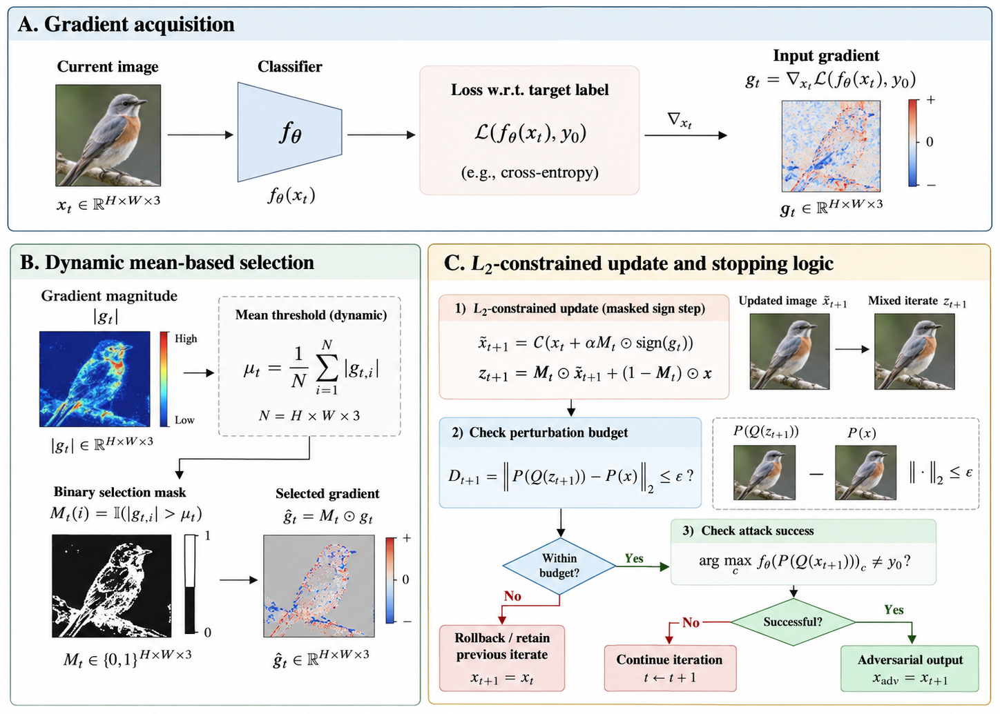

# GSIA supplementary code

This repository contains scripts for the experiments reported in Tables 1–6 and Figure 2. The scripts cover GSIA, PGD, PGDRS, EADEN, and AutoAttack, plus image-quality and L2 measurements.

## Contents

| Folder | Purpose |
| --- | --- |
| `Table 1` | GSIA mask ablations and image-quality measurements. |
| `Table 2` | Attack comparison and L2, PSNR, SSIM measurements. |
| `Table 3` | Perturbation-budget experiments and attack-success evaluation. |
| `Figure 2, Figure 3 and Table 4` | Model training and attacks for the figure and table. |
| `Table 5 and Table 6` | PSNR and SSIM aggregation across attack outputs. |

## Setup

See [requirement.md](requirement.md) for the supplied Windows/Python environment and its exact package snapshot. Model checkpoints, class-index JSON files, image datasets, and generated attack images are external inputs and are not included here.

All machine-specific path literals in the scripts are shown as `...`. Before running a script, replace each `...` with the appropriate dataset, checkpoint, class-index, or output location described by its variable name. A literal `...` is only a placeholder; scripts are not ready to run until paths are configured. For attack scripts, use the method folder as the working directory when its local modules are imported.

## Typical workflow

1. Prepare images and model weights, then configure path placeholders in the chosen script.
2. Run the attack entry point documented in that folder's `readme.md`.
3. Run the relevant evaluation scripts after adversarial images have been saved.

The table and figure folders are separate experiment snapshots. Check each script's model, L2 budget, and dataset settings before comparing results.
